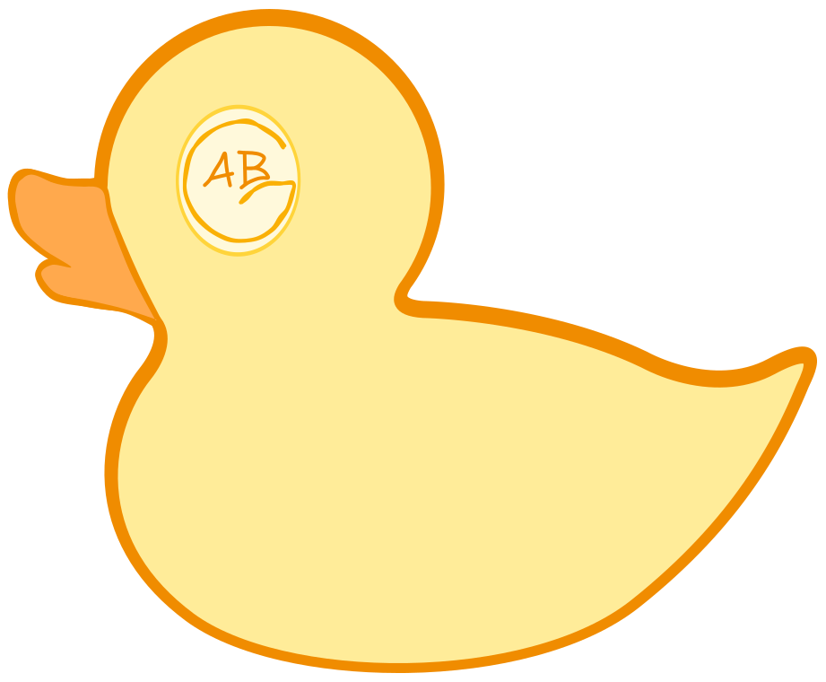

# README

This repo was initially created as a personal website for Alex Blake-Goudemond, namely as a way to join the IndieWeb.

> TL:DR: Jekyll site built from an Obsidian vault, published to `absurdlygoud.com` via GitHub Pages.

## Quick start

- For the first time users, follow the [setup instructions](docs/README.md#setup)
- Edit in the Obsidian vault: absurdly-goud-obsidian
- Leverage Makefile: `make compose-rebuild-no-cache`
- Generated `site_src/` and `_site` are safe to delete (not committed)

## Notes

- Obsidian is the source of truth
- Everything around it is infrastructure designed to be flexible
- For more information, please refer to the [Documentation README](docs/README.md)

## Repository

- **Repository:** `alexBlakeGoudemond/absurdly-goud`
- **Visibility:** Public
- **Hosting:** GitHub Pages
- **Publishing source:** `main` branch, repository root
- **Custom domain:** `absurdlygoud.com`
- **License**: MIT
