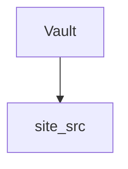

In the pursuit of improving codeblocks for the website I learnt that Jekyll uses [Rouge](https://github.com/rouge-ruby/rouge) to handle syntax highlighting of code snippets! This is called that because it uses a programming language called Ruby - not named after the movie [Moulin Rouge](https://en.wikipedia.org/wiki/Moulin_Rouge!)!

In the screenshots below - notice the lack of colour!

Before the updates to codeblocks, this is what the site looked like on the web: ![[codeblock-screenshot-web-view.png]]

and this is what it looked like on a cellphone (Notice how it runs off the screen): ![[codeblock-screenshot-phone-view.png]]

With the fixes in place, codeblocks now look like this:

on website: ![[codeblock-screenshot-rouge-web-view.png]]

and on the phone:
![[codeblock-screenshot-rouge-phone-view.png]]

On top of this, several codeblock coloring options should work out of the gate:

```python
def func():
    print("Python colour is here")
```

...

```java
public class Main {
    public static void main(String[] args) {
        // Java colouring is here
    }
}
```

...

```bash
# Bash colouring is here
echo "hello"
```

...

```yaml
paginate: 3
paginate_path: "/posts/page:num/"
plugins:
  - jekyll-paginate
```

...

```html
<link rel="stylesheet" href="/assets/css/style.css">
<a href="/posts/">Posts</a>
```

...

```css
.highlighter-rouge {
    max-width: 100%;
    overflow-x: auto;
}
```

...

```ruby
def self.site_title
  "ABsurdly Goud"
end
```

...

```diff
- include_permalink=True
+ include_permalink=False
```

NOTE - this Mermaid diagram styling should not work. Rouge does not support Mermaid by default
