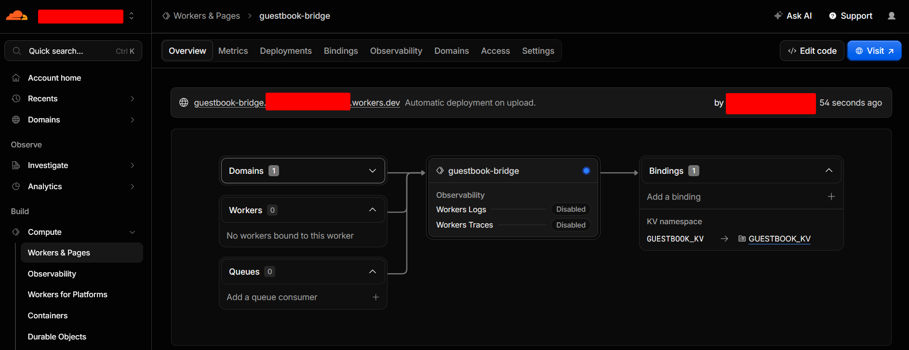
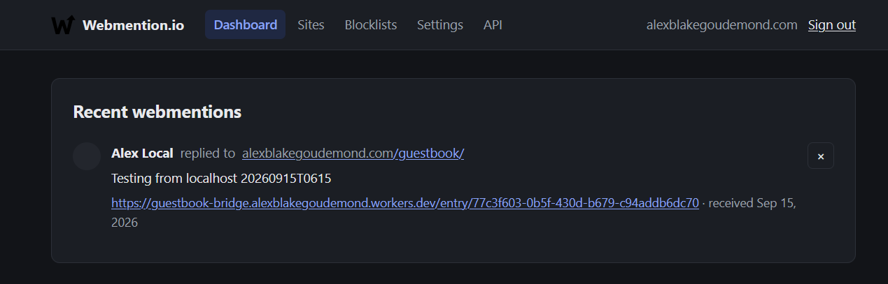
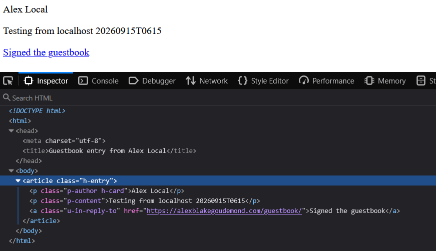

# Cloudflare and Webmentions

This site sends guestbook data to a worker / middleman hosted
on [Cloudflare Workers](https://www.cloudflare.com/products/workers/). The worker interacts with
the [Webmentions.io](https://webmention.io/) API to achieve the feature of a guestbook

A worker is needed as Webmentions.io needs to verify that the the SOURCE URL and TARGET URL exist, so it can parse and
ingest the content. At a later point, the author can then GET the data from Webmentions.io and choose what to do with
it.

## Cloudflare Workers

### Setup and Login

Setup on local machine only:

> If using Node Version manager, ensure using a compatible node version. At the time of writing: `v22.0.0`

```bash
npm install -g wrangler
```

Login and authorize in browser:

```bash
wrangler login
```

### Publish

In Powershell, CD into `.cloudflare/guestbook-bridge` and run:

```bash
wrangler kv namespace create GUESTBOOK_KV
```

> NOTE:
>
> KV namespace itself (the actual storage bucket, with the id Wrangler prints) is a real resource that lives in
> your Cloudflare account, account-wide
>
> GUESTBOOK_KV is just a chosen name that tells this one Worker "when your code says env.GUESTBOOK_KV,
> point it at that namespace." It's defined in `wrangler.toml`

later:

```bash
wrangler deploy
```

If successful, you should see this in Cloudflare Workers



## Webmentions.io

Once you have your guestbook form, and the cloudflare worker receives the submission - it will prepare the Payload and
send it to webmentions.io:



We can also see the page that Cloudflare Workers created with correct microformats for the webmentions.io to parse
successfully:



And that's the POC of it working!

> IMPORTANT
> 
> If doing this yourself - check for hardcoded URLs in guestbook
